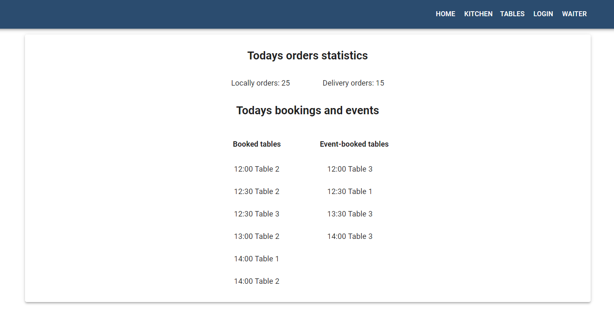
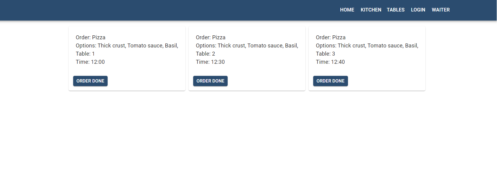
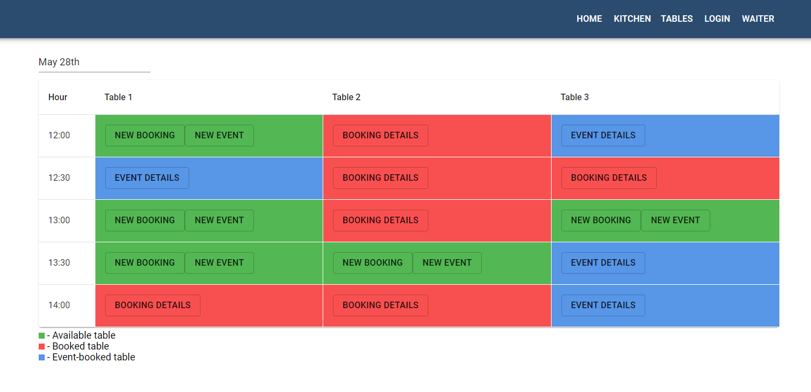
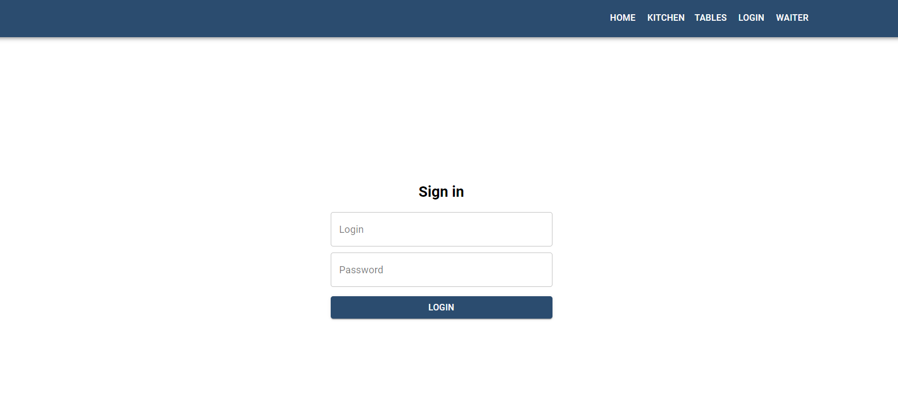
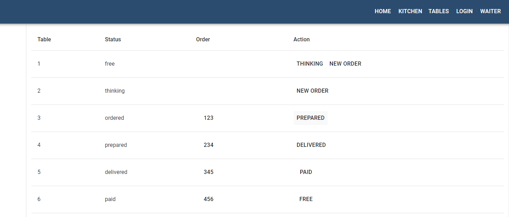

# Development

## URLe dostępne dzięki yarn start

http://localhost:3000 - bieżący projekt, czyli panel administracyjny (webpack-dev-server)
http://localhost:3131 - strona pizzerii dla klientów
http://localhost:3131/api - url API projektu
http://localhost:3131/api/db - podgląd całej bazy danych w API
http://localhost:3131/panel -stan bieżącego projektu (panelu adm.) z momentu uruchomienia (yarn start)

